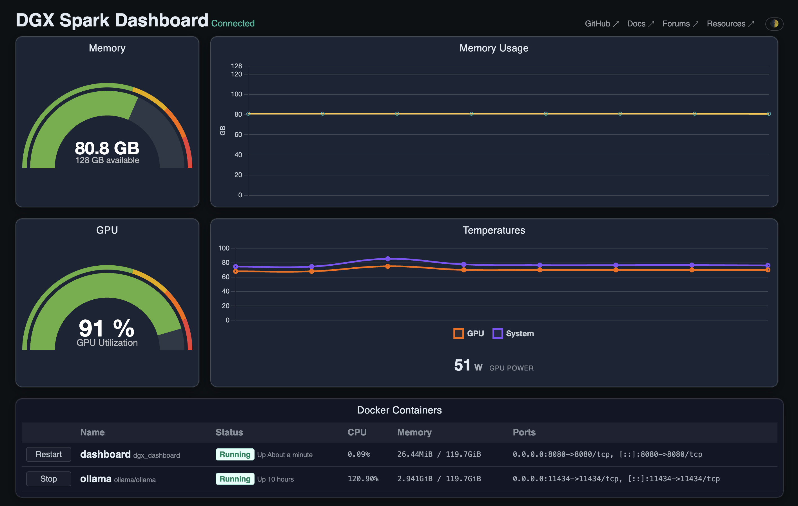

# DGX Spark Dashboard




A lightweight, real-time monitoring dashboard for the [NVIDIA DGX Spark](https://docs.nvidia.com/dgx/dgx-spark/), designed with more informative metrics compared to the built-in system monitor.

- **Accurate memory stats** - uses `MemTotal` & `MemAvailable` (the built-in dashboard confuses GB and GiB)
- **CPU & GPU usage** display
- **Temperature monitoring** for dedicated GPU sensors and a composite system temperature (see note below)
- **Peak temperatures** logging across the session
- **GPU power draw** display
- **Dark/light mode** switchable theme
- **Docker container management** with Start/Stop/Restart controls
- **Network accessible** - binds to `0.0.0.0` (no SSH tunnel needed)
- **Tab title stats** - shows memory, usage %, and temperature at a glance
- **Open source** with immutable builds on GitHub Container Registry

Metrics update every 2s. Docker stats update every 10s. *System* tracks the maximum of 7 onboard thermal zones (CPU, memory, VRMs, and chipset) to ensure the hottest component drives the cooling.

*[View in light mode](images/screenshot-light-mode.png)*

## Running on DGX Spark

### Run latest from ghcr.io

```
docker run -d --gpus all \
    -v /var/run/docker.sock:/var/run/docker.sock \
    -p 8080:8080 \
    --pull=always \
    --restart=unless-stopped \
    --name dashboard \
    ghcr.io/tildahh/dgx_dashboard:latest
```

Including `-v /var/run/docker.sock:/var/run/docker.sock` is only required if you want to see Docker containers on the dashboard. Be aware that this allows the container to run `docker` commands so be sure you trust the image you are running. The images hosted on GHCR are built on GHCR and immutable so you are able to verify the complete source.


### Updating the container

If you leave the container running, it will not automatically update when new versions are published. To update, you'll need to run:

```
docker stop dashboard && docker rm dashboard
```

And then re-run the previous command from above to pull and run the latest version.


### Build and run locally

You can also build your own version locally if you'd like to make changes (or run from a copy of source you control).

```
git clone https://github.com/tildahh/dgx_dashboard
cd dgx_dashboard
docker build -t dgx_dashboard .
docker run -d --gpus all \
    -v /var/run/docker.sock:/var/run/docker.sock \
    -p 8080:8080 \
    --restart=unless-stopped \
    --name dashboard \
    dgx_dashboard
```

---

*Adapted and forked from [DanTup/dgx_dashboard](https://github.com/DanTup/dgx_dashboard)*
