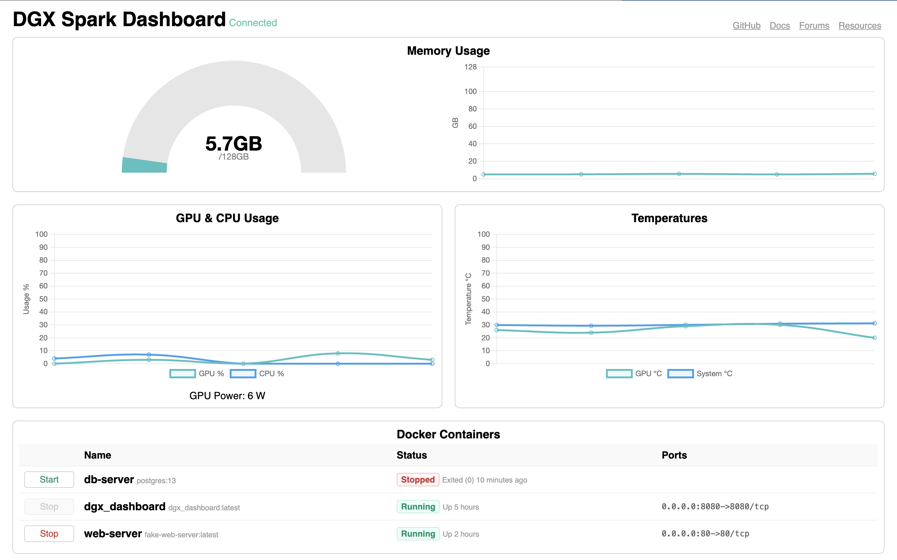

# DGX Spark Dashboard



A simple dashboard for the DGX Spark with some slight differences to the built-in dashboard:

- Binds to `0.0.0.0` so it can be accessed over the network without an SSH tunnel
- Uses `MemTotal` and `MemAvailable` for accurate memory stats (the built-in dashboard confuses GB and GiB)
- Includes GPU power draw
- Includes CPU usage
- Includes GPU and system temperatures
- Includes stats in browser tab title
- Includes a list of Docker containers with CPU/memory usage and Start/Stop buttons
- Open source with immutable builds on GitHub Container Registry

Metrics update every 5s and are only collected while there is a connected client. Docker container stats are updated every 10s.


## Running on DGX Spark

### Run latest from ghcr.io

```
docker run -d --gpus all \
    -v /var/run/docker.sock:/var/run/docker.sock \
    -p 8080:8080 \
    --pull=always \
    --restart=unless-stopped \
    --name dashboard \
    ghcr.io/dantup/dgx_dashboard:latest
```

Including `-v /var/run/docker.sock:/var/run/docker.sock` is only required if you want to see Docker containers on the dashboard. Be aware that this allows the container to run `docker` commands so be sure you trust the image you are running. The images hosted on GHCR are built on GHCR and immutable so you are able to verify the complete source.


### Updating the container

If you leave the container running, it will not automatically update when new versions are published. To update, you'll need to run:

```
docker stop dashboard && docker rm dashboard
```

And then re-run the previous command from above to pull and run the latest version.


### Build and run locally

You can also build your own version locally if you'd like to make changes (or run from a copy of source you control).

```
git clone https://github.com/DanTup/dgx_dashboard
cd dgx_dashboard
docker build -t dgx_dashboard .
docker run -d --gpus all \
    -v /var/run/docker.sock:/var/run/docker.sock \
    -p 8080:8080 \
    --restart=unless-stopped \
    --name dashboard \
    dgx_dashboard
``` 

